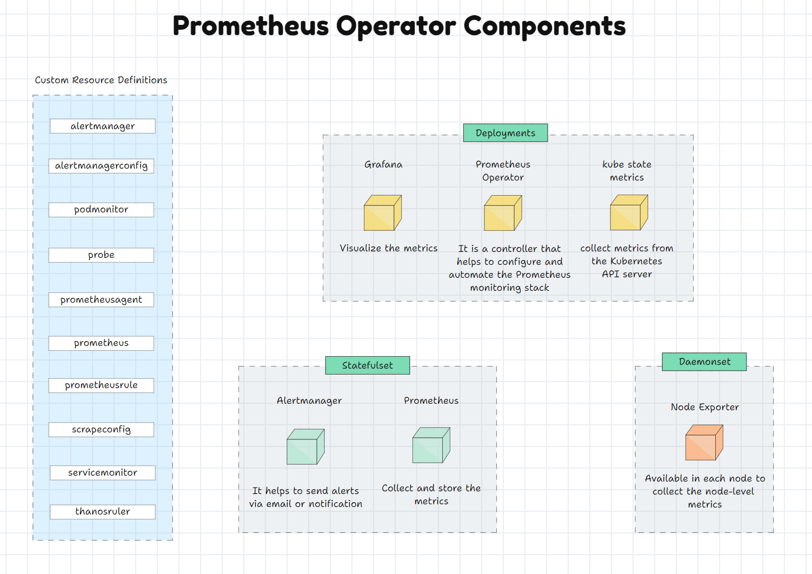
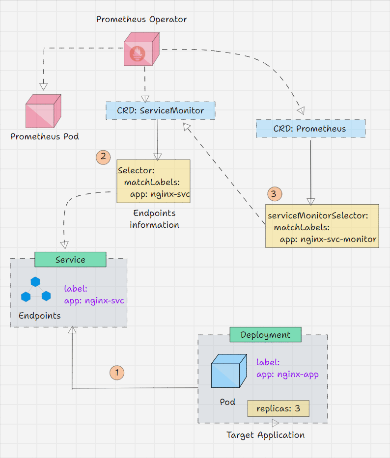

### Persistant Storage
Prometheus - NFS provision is required ~ 8GB
Grafana - NFS provision is required ~ 3GB
Alertmanager - persistance is not required
Kube-State-Metrics - persistance is not required
Node Exporter, etc - persistance is not required

## Prometheus Scraping
* Install a jenkins plugin "Prometheus metrics plugin"
✔️ Use proper PVC-backed storage

Ensure each Prometheus instance uses a dedicated PersistentVolume (block-based or xfs/ext4)—not shared storage:

    Avoid shared network storage (NFS, CephFS) for Prometheus TSDB.

    Use a unique PVC per pod, ensuring isolation and lock capability.

✔️ Remove stale lock file (carefully)

If the storage is dedicated and still fails:

    Scale down or stop the Prometheus pod/container.

    Exec into the volume mount and remove the lock file:

kubectl exec pod/prometheus-<id> -- rm /prometheus/lock

## Alertmanager
Create a Kubernetes Secret containing your password file

Put your SMTP password (app password from gamil) in a file (e.g. auth_password) and create a Secret:
`kubectl -n monitoring create secret generic alertmanager-smtp-secret \
  --from-file=auth_password`   

Mount the Secret into your Alertmanager pod, the file name is confgured in field 'path' (for me it is smtp_auth_password)

    `k apply -f prometheus-stack/10-alert-cm.yaml
    k apply -f prometheus-stack/11-alert-deploy-svc.yaml`

## Grafana
Recover Locked Database File [https://opsverse.io/2022/12/15/grafana-sqlite-and-database-is-locked/?utm_source=chatgpt.com]
`   
initContainers:
- name: grafanadb-clone-and-replace
  image: keinos/sqlite3
  command:
  - "/bin/sh"
  - "-c"
  - "/usr/bin/sqlite3 /var/lib/grafana/grafana.db '.clone /var/lib/grafana/grafana.db.clone'; mv /var/lib/grafana/grafana.db.clone /var/lib/grafana/grafana.db; chmod a+w /var/lib/grafana/grafana.db"
  imagePullPolicy: IfNotPresent
  securityContext:
    runAsUser: 0
  volumeMounts:
  - name: storage
    mountPath: "/var/lib/grafana"
`   
We need the sqlite3 client (to interact with the DB), so that image is pulled. When the container starts up (before the grafana-server itself, as this is an init container), it clones the locked grafana.db. It then replaces /var/lib/grafana/grafana.db with the newly cloned DB file.

The first thing you can try is to enable Write-Ahead Logging (WAL). In grafana.ini:  
` 
  [database]:
  ...
  wal: true
  ...
  cache_mode: shared
  ...
`   
This should only be changed if enabling WAL is not possible for you. From their official documentation, SQLite claims it’s obsolete.

## Vault scraping
1. Enable k8s service account to use a jwt token to auth to vault and access sys/metrics endpoint:
Add "prometheus" policy in vault acl policies UI:
`
  path "sys/metrics*"
  {
    capabilities = ["read", "list"]
  }
`     
`kubectl exec -n "$VAULT_K8S_NAMESPACE" vault-0 -- \
  vault write auth/kubernetes/role/prometheus \
    bound_service_account_names="k8mon-prometheus" \
    bound_service_account_namespaces="monitoring" \
    policies="prometheus" \
    ttl="1h"
`      
create vault-agent-config.hcl file
`   
kubectl create configmap -n monitoring vault-agent-config \
  --from-file=./vault-agent-config.hcl
`   
check if correct:  
`kubectl get -n monitoring configmap vault-agent-config -o yaml`  

# Prometheus Operator Stack

Add the Vault agent as a Prometheus sidecar:
--------------------
### Vault Secret Operatpr scraping
`kubectl get prometheus -n monitoring`  
i got > `k8mon-prometheus`  
`kubectl get prometheus -n monitoring k8mon-prometheus -o=jsonpath='{.spec.serviceMonitorSelector}'`  
i got > `{"matchLabels":{"release":"prometheus"}}`  

i create this ServiceMonitor in monitoring namespace:
`
  namespaceSelector:
    matchNames:
    - vault
  selector:
    matchLabels:
      control-plane: controller-manager
`
and Helm creates a SM, but creating SM inside different namespaces is eaier bc you do not need to release new helm chart revision. Check out  postgres-qube SM in sonar namespace.
`spec:
    endpoints:
    - port: http-metrics
    namespaceSelector:
      matchNames:
      - sonar
    selector:
      matchLabels:
        app.kubernetes.io/component: metrics
        app.kubernetes.io/instance: postres
        app.kubernetes.io/name: postgresql`

`app.kubernetes.io/instance: argocd
app.kubernetes.io/name: argocd-metrics` 

So, every namespace and service (or Pod) must have these labels to be scraped

ScrapeClass (did not work for me)
To scrape petclinic springboot app i needed to resolve this error: 
  err="received unsupported Content-Type \"application/vnd.spring-boot.actuator.v3+json\" and no fallback_scrape_protocol specified for target"
edit prometheus CRD and add:
  spec:
    scrapeClasses:
      - fallbackScrapeProtocol: PrometheusText1.0.0
        name: springboot-scrape
edit serviceMonitor and add:
  spec:
    scrapeClass: springboot-scrape