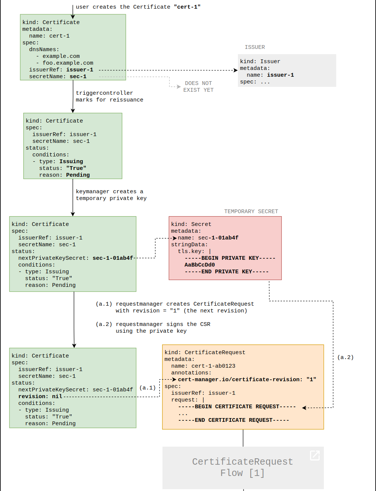

# TLS/HTTPS with Traefik, cert-manager & Vault
-------------------
As a result in our infra we're going to have 2 separate CAs:
1. Vault TLS server certificate ( my K8S CA )
2. Vault PKI engine CA ( Vault’s internal CA )
Benefits:
    Security isolation: If the PKI CA is compromised or rotated, Vault’s TLS server cert can remain stable and trusted.

    Operational flexibility: You can manage Vault’s TLS lifecycle independently from your app certs lifecycle.

    Easier automation: Vault PKI CA can be rotated frequently without impacting Vault’s API TLS connectivity.
Issuer:	
For 1. => External CA (your k8s CA or custom CA)	
For 2. => Self-signed internal Vault PKI root CA
-------------------
Prerequisites
1. Create secrets per namespace with Vault TLS CA
        kubectl create secret generic tls-ca \
        -n jenkins \
        --from-file=ca.crt=vault.ca
    This becomes handy when creating Issuer resource

Generate the root CA

vault write pki/root/generate/internal \
    common_name=cluster.com \
    ttl=8760h

Set the PKI URLs; The cert-manager will call these URLs to get the certificates and validate certificates that are revoked.

vault write pki/config/urls \
    issuing_certificates="https://vault-internal.vault.svc.cluster.local:8200/v1/pki/ca" \
    crl_distribution_points="https://vault-internal.vault.svc.cluster.local:8200/v1/pki/crl"

Define the PKI role (see it in vault UI /pki/roles/cluster-dot-com  ) 
Set the allowed domain to cluster.com, and also allow subdomains

vault write pki/roles/cluster-dot-com \
    allowed_domains=cluster.com \
    allow_subdomains=true \
    require_cn=false \
    max_ttl=72h

    Reponse: {
        Key                                   Value
        ---                                   -----
        allow_any_name                        false
        allow_bare_domains                    false
        allow_glob_domains                    false
        allow_ip_sans                         true
        allow_localhost                       true
        allow_subdomains                      true
        allow_token_displayname               false
        allow_wildcard_certificates           true
        allowed_domains                       [cluster.com]
        allowed_domains_template              false
        allowed_other_sans                    []
        allowed_serial_numbers                []
        allowed_uri_sans                      []
        allowed_uri_sans_template             false
        allowed_user_ids                      []
        basic_constraints_valid_for_non_ca    false
        client_flag                           true
        cn_validations                        [email hostname]
        code_signing_flag                     false
        country                               []
        email_protection_flag                 false
        enforce_hostnames                     true
        ext_key_usage                         []
        ext_key_usage_oids                    []
        generate_lease                        false
        issuer_ref                            default
        key_bits                              2048
        key_type                              rsa
        key_usage                             [DigitalSignature KeyAgreement KeyEncipherment]
        locality                              []
        max_ttl                               72h
        no_store                              false
        not_after                             n/a
        not_before_duration                   30s
        organization                          []
        ou                                    []
        policy_identifiers                    []
        postal_code                           []
        province                              []
        require_cn                            false
        serial_number_source                  json-csr
        server_flag                           true
        signature_bits                        256
        street_address                        []
        ttl                                   0s
        use_csr_common_name                   true
        use_csr_sans                          true
        use_pss                               false
    }
Create ACL policies
The following policy grants permissions to use the PKI engine:
    pki* → Read/list PKI configuration (e.g., fetch CA cert)
    pki/sign/cluster-dot-com → Sign CSR manually (optional)
    pki/issue/cluster-dot-com → Issue certs using the PKI role cluster-dot-com
    🟢 This policy is needed by any identity that should request certificates from Vault.

vault policy write pki - <<EOF
path "pki*" { capabilities = ["read", "list"] }
path "pki/sign/cluster-dot-com" { capabilities = ["create", "update"] }
path "pki/issue/cluster-dot-com" { capabilities = ["create"] }
EOF

Set the service account for the issuer; include your namespace; In vault UI go to Access panel -> kubernetes/issuer
    Note: if it fails, it might help : vault auth enable kubernetes

vault write auth/kubernetes/role/jenkins-role \
  bound_service_account_names=jenkins-sa \
  bound_service_account_namespaces=jenkins \
  policies=pki \
  ttl=1h

vault write auth/kubernetes/role/sonar-role \
  bound_service_account_names=sonar-sa \
  bound_service_account_namespaces=sonar \
  policies=pki \
  ttl=1h

vault write auth/kubernetes/role/argo-role \
  bound_service_account_names=argo-sa \
  bound_service_account_namespaces=argo \
  policies=pki \
  ttl=1h

vault write auth/kubernetes/role/applion-role \
  bound_service_account_names=application-sa \
  bound_service_account_namespaces=application \
  policies=pki \
  ttl=1h

vault write auth/kubernetes/role/prometheus-role \
  bound_service_account_names=prometheus-sa \
  bound_service_account_namespaces=monitoring \
  policies=pki \
  ttl=1h

vault write auth/kubernetes/role/grafana-role \
  bound_service_account_names=grafana-sa \
  bound_service_account_namespaces=monitoring \
  policies=pki \
  ttl=1h

It will not work untill we set up Vault Authentication Method. How to choose one, depends on your environment. My Vault server is running inside the Kubernetes cluster, so i go with Kubernetes Auth
### Kubernetes Auth as Vault Authentication Method
The Kubernetes auth method requires a token_reviewer_jwt, which is a JWT token that is used by Vault to call the TokenReview API of the Kubernetes API server. This endpoint is then used to verify the JWT token that is provided by cert-manager. 
This token_reviewer_jwt token can be provided by the Kubernetes service account token that is mounted into the Vault pod.✅ is enabled when Vault auto-detects that it is running in a Kubernetes cluster. Ypu can peek at it from a pod: "cat /var/run/secrets/kubernetes.io/serviceaccount/token"

vault auth enable kubernetes 

vault write auth/kubernetes/config \
  token_reviewer_jwt="$(cat /var/run/secrets/kubernetes.io/serviceaccount/token)" \
  kubernetes_host="https://$KUBERNETES_PORT_443_TCP_ADDR:443" \
  kubernetes_ca_cert=@/var/run/secrets/kubernetes.io/serviceaccount/ca.crt

(P.S. this also important for VSO integration in the future)
-----------------
Let's go back to our cluster-side config

Create Service Account:
k create -f issuers-service-accounts.yaml

Create Issuer resource, This is called by the cert-manager to request the certificate when the certificate is expired/required.
We point it to the vault server, provide the path to the PKI that we configured in the previous section, and provide the service account to use (issuer) 

k create -f jenkins/issuer_with_rbac.yaml

### Ingress configs
To use cert-manager with Traefik’s IngressRoute for automatic TLS cert provisioning from your Vault Issuer, here’s how you can set it up:

Create a certificate referencing non-existing secret
k create -f vault/certificate.yaml

Update your IngressRoute by adding annotation to reference cert manager and that non-existing secret reference:
    annotations:
        cert-manager.io/issuer: "vault-issuer"
and 
    tls:
        secretName: jenkins-tls-cert 

k apply -f jenkins/jenkins-agents/ingressroute.yaml

Add that CA that you have generated inside Vault pki to your browser's trusted CAs

Check if this worked:
1. secret jenkins-tls-cert in jenkins namespace
2. Browse https://jenkins.cluster.com and see if padlock 🔐 is ok

Help commands:
Describe the role:
    vault read auth/kubernetes/role/jenkins-role

Check certificate data from k8s secret:
kubectl get secret jenkins-tls-cert -n jenkins -o jsonpath='{.data.ca\.crt}' | base64 -d | openssl x509 -text -noout

Check if your browser has corrct certificate:
echo | openssl s_client -connect jenkins.cluster.com:443 -servername jenkins.cluster.com | openssl x509 -noout -issuer -subject -dates