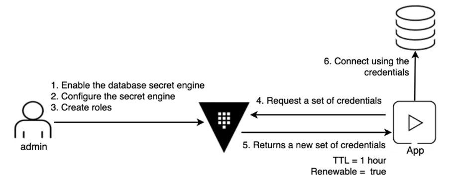
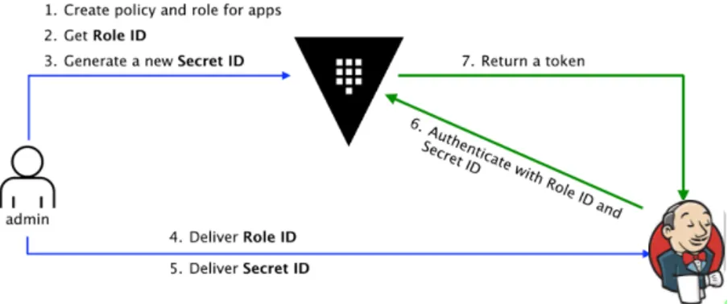

# Secret injection into Jenkins Pipelines using approle (kv2) 



Why Vault instead of Jenkins Credentials ?
    Problem with keeping our secret credentials in Jenkins is how pipeline handles credentials. Whenever a pipeline obtains a secret that is scoped, there are no limitations to it on how much and in what ways the pipeline can use them. This poses a potential security threat considering the pipeline may be interacting with uncontrolled external.

The advantage of using Vault is
    · It adds another layer of authentication over Jenkins.
    · We can add multiple policies to access the same secret.
    · Vault have rotation policy to any of the secrets you create.
    · Centrally place to store, access and distribute secrets for organization.


## AppRole Authentication Method

`vault auth enable approle`

`vault write auth/approle/role/jenkins-approle token_num_uses=0 secret_id_num_uses=0 policies="jenkins-approle-pols"`

fetch role id
`vault read auth/approle/role/jenkins-approle/role-id`  
    output: `role_id   <my role id>`  

Get a SecretID issued against the AppRole:
`vault write -f auth/approle/role/jenkins-approle/secret-id`  
    output:
    > `secret_id             <your secret_id>`  
    > `secret_id_accessor    <your secret_id_accessor>`  
Go to Manage Jenkins/Credentials/System/Global Credentials(unrestricked) to create a secret that allows Jenkins to retrieve secrets from Vault (in pipelines and in Credention store) 
Type: Vault AppRole Credential
Scope: Global (the default one)
Put in Role ID and Secret ID than we saved before
Path: Approle
Namespace: leave it empty
ID: jenkins-approle
Description: <fill it as you want>

Enable KV v2 at a custom path (secrets/)
`vault secrets enable -path=secrets -version=2 kv`

`vault put secrets/jenkins/cicd sonar_token=<my sonar token>`

### Jenkins cannot trust Vault TLS Cert
`sun.security.provider.certpath.SunCertPathBuilderException: unable to find valid certification path to requested target`  

I checked:
`openssl s_client -connect vault-1.vault-internal.vault.svc.cluster.local:8200 -CApath /etc/ssl/certs `
It worked, but we need to check java certificate store. I fould out that the problem does not resolves with custom jnlp that contains vailt co cert in its local truststore, and i wanna checked if jenkins controller might need to have vault ca cert in a truststore instead. 
Hypothesis: Even though your pipeline runs on the Kubernetes agent pod with your image, the Vault plugin (withVault {} block) likely initiates part of its logic on the Jenkins controller JVM, not inside the agent container.

I built a custom docker jenkins/jenkins:lts image:
1. Find a path to truststore: 
`find / -name cacerts 2>/dev/null`
  output: `/opt/java/openjdk/lib/security/cacerts`

2. Go to jenkins/jenkins-agents folder and copy vault/vault.ca file to the same directory. Add Dockerfile (my is at jenkins/jenkins-agents/Dockerfile).
`docker build -t askdragon/jenkins-controller:vault-ca-1 .`
`docker push askdragon/jenkins-controller:vault-ca-1`

3. Update deployment-service.yaml image to you new image (askdragon/jenkins-controller:vault-ca-1) and run:
`k apply -f deployment-service.yaml`

Personally, before updationg deployment I have created a test pod similar to jenkins-deployment and run: 
`k exec jenkins-test -n jenkins -it -- keytool -list -keystore /opt/java/openjdk/lib/security/cacerts -storepass changeit | grep -i vault`

### Create Jenkins pipeline with the following script:

```
    def secrets = [
        [path: 'secrets/jenkins/cicd', engineVersion: 2, secretValues: [
            [vaultKey: 'sonar_token']]]
    ]
    def configuration = [
        vaultUrl: 'https://vault-1.vault-internal.vault.svc.cluster.local:8200',
        vaultCredentialId: 'jenkins-approle',
        engineVersion: 2
    ]

    pipeline {
    agent {
        label 'kubeagent'
    }

    environment {
        JAVA_TOOL_OPTIONS = "-Djavax.net.debug=ssl,certpath"
    }

    options {
        buildDiscarder(logRotator(numToKeepStr: '20'))
        disableConcurrentBuilds()
    }

    stages {
        stage('Check Java Truststore for Vault CA') {
            steps {
                echo 'Checking if Vault CA is in the Java truststore...'
                sh '''
                 path_to_certs=$(find / -name cacerts 2>/dev/null | head -n 1)
                 if [ -n "$path_to_certs" ]; then
                    echo "Found truststore"
                    keytool -list -keystore "$path_to_certs" -storepass changeit | grep -i vault
                else
                    echo "no cacerts file found in the system"
                fi
                '''
            }
        }

        stage('Vault') {
            steps {
                withVault([configuration: configuration, vaultSecrets: secrets]) {
                    sh 'echo "Sonar token: $sonar_token"'
                }
            }
        }
    }
} 
```
### How to add credential from Vault
Go to Manage Jenkins/Credentials/System/Global Credentials(unrestricked) to create a specific secret from Vault secrets/jenkins store
Type: Vault Secret Text Credentials
Scope: Global (the default one)
Namespace: leave it empty
Prefix Path: leave it empty
Path: secrets/jenkins/cicd
Vaulr Key: sonar_token
K/V Engine Version: 2
ID: sonar_token
Description: <fill it as you want>

