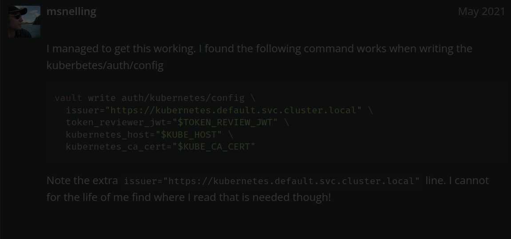

#  Vault Agent Injector set up 
 I have configured:
 Vault Agent Injector validates the Vault server TLS certificate. This ensures secure communication between your Kubernetes pods and the Vault server, validating that you are connecting to the correct Vault server and preventing man-in-the-middle (MITM) attacks.

Prepare variables:
 
Go to Vault
    create Vault secret for application and mySQL db
    create Vault policy that can see secrets. 'data' path needs to be inserted when dealing with API level. Also you can check API path in vault ui where you have created a secret to get correct path for this policy. 
`kubectl exec -n $VAULT_K8S_NAMESPACE vault-0 -it -- sh`  
```
vault policy write injector-policy -<<EOF
path "secrets/data/application" {
capabilities = ["read"]
}
EOF
```
`
vault write auth/kubernetes/role/agent-injector-role \
bound_service_account_names=vaultagent-injector \
bound_service_account_namespaces=application \
policies=injector-policy \
ttl=1h`  

Vault needs Vault CA in Vault Agent sidecar:
Create secret in application namespace: 
kubectl create secret generic tls-ca -n application --from-file=ca.crt=vault.ca
Add annotations to deployment

helm repo add bitnami https://charts.bitnami.com/bitnami
helm upgrade --install mysql bitnami/mysql -n application -f overrides.yaml


Possible solution to authentication problem 
auth.handler: error authenticating: error="context deadline exceeded" backoff

+ find in vault UI "JWT issuer"; if no issuer is specifies then this plugin will use kubernetes.io/serviceaccount as a default issuer
OR apply
```vault write auth/kubernetes/config \
    kubernetes_host="https://$KUBERNETES_PORT_443_TCP_ADDR:443" \
    token_reviewer_jwt="$(cat /var/run/secrets/kubernetes.io/serviceaccount/token)" \
    kubernetes_ca_cert=@/var/run/secrets/kubernetes.io/serviceaccount/ca.crt disable_iss_validation=true\
    issuer="https://kubernetes.default.svc.cluster.local"```
This works but i guess we do not need issuer. only kubernetes_host, token_reviewer_jwt, kubernetes_ca_cert and disable_iss_validation needs to be provided.cop


